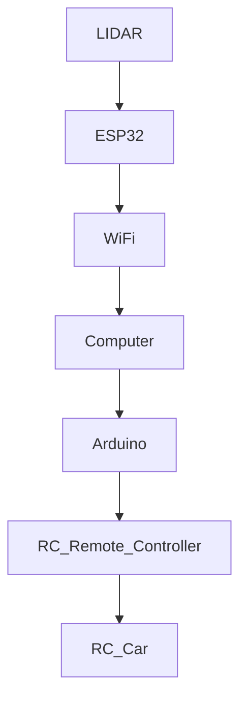

# 🩻 Autonomous Car - Powered by Lidar

<p align="center">

</p>

> *This image is pure fictional and is not the final product of the project*

## **ℹ️ About**
This project was born after the first-year project at Epitech that introduced the principles of AI through a simulation of a car on a virtual car circuit.
The project aimed to teach fundamental AI concepts by developing a basic autonomous system. 
The car only sent LIDAR information of visualized  space, with this the goal is to make the car autonomous, is only software development, at this point.
This experience inspired us to bring the concept to using a real LIDAR and an RC car, transforming theoretical knowledge into a practical application of robotics ad AI.

### **📃 Description**

**What is AI?**
Artificial Intelligence (AI) is a field of computer science that creates machines capable of performing tasks that require human intelligence, such as recognizing images, making decisions, and learning from experiences.

**What is a LIDAR?**
LIDAR (Light Detection and Ranging) is a technology that uses laser light to measure distances and generate 3D maps of the environment. It is commonly used for mapping, obstacle detection, and autonomous vehicles.

**What is an Autonomous Car?**
An autonomous car is a vehicle that can navigate and operate without human intervention, using sensors, cameras, LIDAR, radar, and AI to drive safely and follow traffic rules.


## **⚙️ Technology Notes**

The application utilizes the following technologies:

- **Hardware:**
    - **LIDAR:** A LIDAR sensor is used to measure distances and generate 3D maps of the environment.
    - **RC Car:** A remote-controlled car is used as the physical platform for the autonomous system.
    - **Arduino:** An Arduino microcontroller is used to communicate with a computer and control the RC car via the modified remote controller.
    - **ESP32:** An ESP32 microcontroller is used to communicate with the LIDAR sensor and send data to the computer via WIFI.
    - **computer:** A computer is used to process data from the LIDAR sensor and control the RC car.

- **Software:**
  - **Python:** Python is used to develop the AI algorithms and control the RC car.
  - **C** C is used to program the Arduino and ESP32 microcontrollers.


## 🛠️ schematics
    



## **🙍‍♂️ Contributors:**

##" **📟 Embarked electronic and retro-engineering:**
- [Simon GANIER-LOMBARD](https://github.com/6im0n)

### **👨‍💻 Software development:**
- [Simon GANIER-LOMBARD](https://github.com/6im0n)
- [Alban PERALTA](https://github.com/Peralban)

### **🧊 3D modeling:**
- [Alban PERALTA](https://github.com/Peralban)

## **🎮 How to Use:**

1. Connect the lidar to the powerbank (check if batery is ready and charge, car battery and powebank
2. Go to your pc and connect the network created by the ESP32  (CAR_WIFI)
3. Start the car (button under the car) + battery connected and charged
4. Connect the controller (PS5 / PS4) to the computer
3. Connect the remote controller (of the car) to the computer via the blue USB
5. wait 5sec
6. run ```sudo chmod 777 /dev/ttyACM0``` ACM0 port can be also ACM1 or ACM2, etc...
7. run the python script ```python3 CarAI.py```

```bash
python3 CarAI.py
```
> Note: You may need to install rules into you linux for the controller

you can use the following command to install the rules:
```bash
sudo cp 70-ps5-controller.rules /etc/udev/rules.d/
```

if you use the controller with the computer, you can use the following command to install the required library:
```bash

### **🚗 If you use the RC car:**
- **Step 1:** Connect the modified RC controller arduino to the computer.
- **Step 2:** Check the red light on the remote controller to ensure it is connected. if it's blinking, that means arduino has not sent the initialisation process. so way the LED to stop blinking. (approximately 5 seconds)
- **Step 3:** Check the connection between the LIDAR sensor and the ESP32 microcontroller.
- **Step 4:** Connect the LIDAR sensor to the external battery.
- **Step 5:** Run the Python script to start the autonomous car.
- **Step 6:** Enjoy the ride!

Python script to start the autonomous car:
```bash 
python3 CarAI.py
```

Maybe you need to install some library to run the script, you can do it with the following command:
```bash
pip install -r requirements.txt
```
Fedora user can use the following command:
```bash
sudo dnf install hidapi hidapi-devel
```
Debian user can use the following command:
```bash
sudo apt-get install libhidapi-dev
```

### **🔧 If you make you own car:**
- **Step 1:** Assemble the hardware components (LIDAR, RC car, Arduino, ESP32, computer).
- **Step 2:** Connect the LIDAR sensor to the ESP32 microcontroller.
- **Step 3:** Modify the RC car to be controlled by the Arduino microcontroller (with SPI controlled digital potentiometer).
- **Step 4:** Program the Arduino and ESP32 microcontrollers to communicate with the computer.

In communication folder you can find : 

The code of arduino and the RC remote controller, you can find it in the repository of the project.
```
file: communication-with-car-with-RC-form-PC.in
```

The code of the ESP32 and the LIDAR, you can find it in the repository of the project.
```
file: communication-with-lidar-to-PC.ino
```
- **After** [Use the car with the PC](#🚗-If-you-use-the-RC-car:)

## **👐 Contribute:**

Feel free to explore the code, contribute, or provide feedback.
